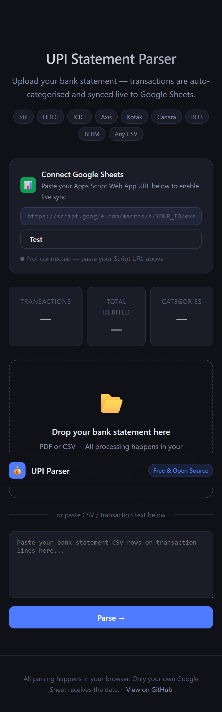

# 💰 UPI Expense Tracker

A free, open-source tool to parse Indian bank statements (PDF/CSV) and sync transactions live to Google Sheets — with auto-categorisation for 12 expense categories.

**Live demo →** `https://santhoshkrishs.github.io/Project-UPI-expense-tracker/`



---

## ✨ Features

- 📂 **Upload PDF or CSV** bank statements from any Indian bank
- 🤖 **Auto-categorises** transactions — Housing, Food, Transport, Utilities, Health, and 8 more
- 📊 **Live sync to Google Sheets** — no duplicates, deduplication built-in
- ⬇️ **Download CSV** or copy-paste into any spreadsheet
- 🔒 **100% private** — all parsing happens in your browser; only your own Google Sheet receives data
- 🌙 **Dark mode** UI, mobile-friendly

### Supported Banks
SBI · HDFC · ICICI · Axis · Kotak · Canara · Bank of Baroda · BHIM · Any standard CSV export

---

## 🗂 Project Structure

```
upi-expense-tracker/
├── index.html          # The web app (single file, works offline)
├── scripts/
│   └── Code.gs         # Google Apps Script — paste into your Sheet
├── docs/
│   └── setup-guide.md  # Step-by-step setup instructions
├── .github/
│   └── workflows/
│       └── deploy.yml  # Auto-deploy to GitHub Pages on push
├── LICENSE
└── README.md
```

---

## 🚀 Quick Start

### 1. Fork & Enable GitHub Pages

1. Click **Fork** (top-right of this page)
2. Go to your fork → **Settings → Pages**
3. Source: **Deploy from a branch** → `main` → `/ (root)` → **Save**
4. Your site is live at `https://santhoshkrishs.github.io/Project-UPI-expense-tracker/`

### 2. Set Up Google Sheets Sync

Follow the [detailed setup guide](docs/setup-guide.md) to connect your Google Sheet in ~5 minutes.

**Short version:**
1. Create a new Google Sheet
2. Open **Extensions → Apps Script**
3. Paste the contents of `scripts/Code.gs`
4. Deploy as a **Web App** (Execute as: Me, Access: Anyone)
5. Copy the Web App URL into the site's "Connect Google Sheets" box

### 3. Use It

1. Download your bank statement as PDF or CSV
2. Upload or paste it on the site
3. Review / fix any categories in the table
4. Click **Sync to Google Sheets** ✅

---

## 🏦 Getting Your Bank Statement

| Bank | Steps |
|------|-------|
| **SBI** | NetBanking → My Accounts → Account Statement → Download CSV |
| **HDFC** | NetBanking → Accounts → Account Statement → Download |
| **ICICI** | iMobile / NetBanking → Statements → Download CSV |
| **Axis** | NetBanking → Accounts → e-Statement → CSV |
| **Kotak** | NetBanking → Account → Statement → Download |
| **BHIM/UPI** | Most banks let you download from their app → Passbook → Download |

---

## 📁 Google Sheet Structure

After syncing, your sheet will have three tabs:

| Sheet | Contents |
|-------|----------|
| **Transaction Log** | Every transaction with date, description, amount, category, month |
| **Dashboard** | Auto-updated category totals and month-wise spend |
| **Budget** | (Optional) Add your monthly budgets here |

---

## 🛠 Local Development

No build tools needed — it's just a single HTML file.

```bash
git clone https://santhoshkrishs.github.io/Project-UPI-expense-tracker/
cd upi-expense-tracker
# Open index.html in your browser, or serve with:
npx serve .
```

---

## 🤝 Contributing

Pull requests are welcome! Ideas for improvement:

- [ ] Add support for more banks / statement formats
- [ ] Budget vs actual comparison chart in the Sheet
- [ ] SMS transaction parser (for bank alerts)
- [ ] Dark/light mode toggle
- [ ] More granular sub-categories

**To contribute:** Fork → create a branch → make changes → open a PR.

---

## 📄 License

MIT — free to use, modify, and distribute.
